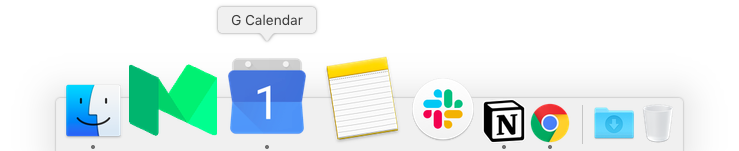

# Nativefier (tweaked)

[](https://travis-ci.org/jiahaog/nativefier)
[](https://codeclimate.com/github/jiahaog/nativefier)
[](https://www.npmjs.com/package/nativefier)
[](https://david-dm.org/jiahaog/nativefier)



Build a native Google Calendar app for macOS – based on the amazing work of [Jia Hao's Nativefier](https://github.com/jiahaog/nativefier)

*(this repository just intent to show how to use and improve Nativefier)*

## Installation

### Requirements

- macOS 10.9+ / Windows / Linux
- [Node.js](https://nodejs.org/) `>=6` (works fine with `node 10.17.0` and `glup 3.9.0`)
- See [optional dependencies](#optional-dependencies) for more.

```bash
git clone https://github.com/HenriChabrand/nativefier
```

## Usage

Creating a native Google Calendar desktop app:

```bash
npm run build-and-package-app
```
git clone https://github.com/HenriChabrand/nativefiergit clone https://github.com/HenriChabrand/nativefier
